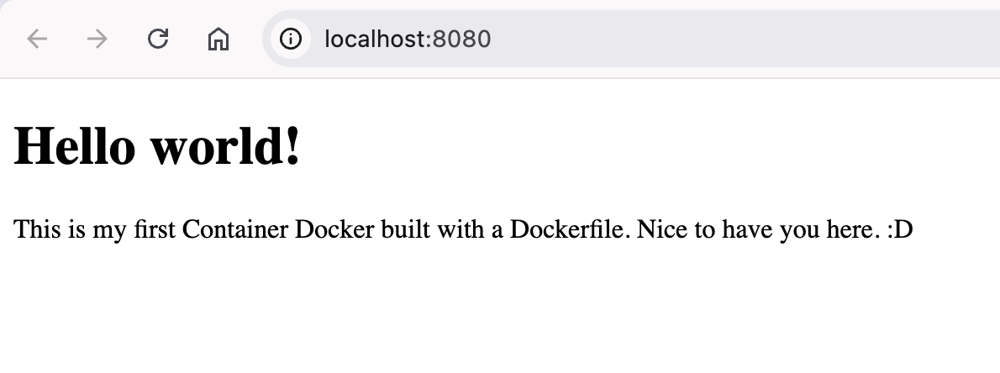

# Docker - My first container image


## Description
This repository is to put in pratice fundamentals concepts I have learned in my studies about Docker.

## Requirements
* [Install Docker](https://docs.docker.com/desktop/)

## To run this project
### In your terminal:
1. Clone this repository
```bash
git clone https://github.com/lamorasjr/docker-my-first-container.git
```
2. Access the this repository directory
```bash
cd docker-my-first-container
```

3. Build the Docker image
```bash
docker build . -t first-container-image
```

4. Create and run the container
```bash
docker run -d --name first-container -p 8080:80 first-container-image
```

5. On your web browser, access the app by link below:
```
http://localhost:8080/
```

## To remove the installed resources
### In your terminal:
1. Stop the container
```bash
docker stop first-container
```
2. Delete the container
```bash
docker rm first-container
```

3. Delete the container image
```bash
docker rmi first-container-image
```

